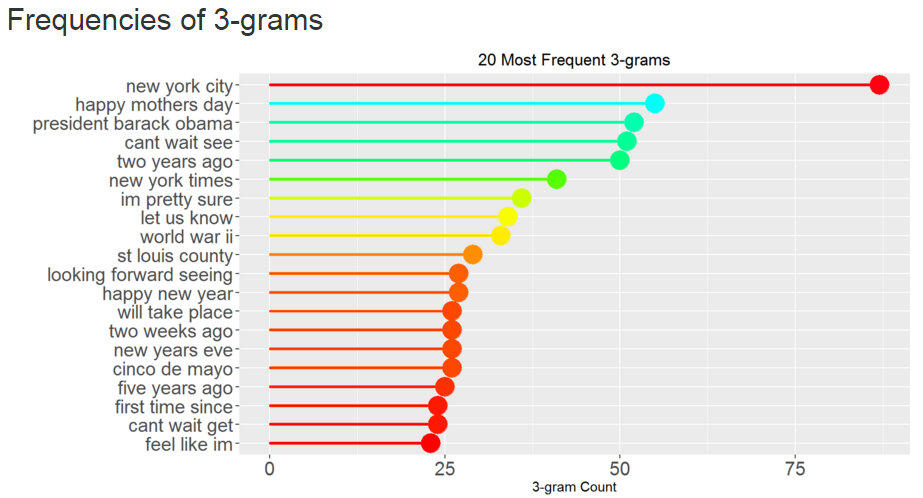
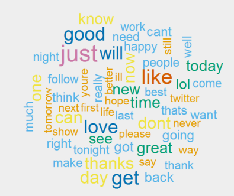

---
title       : Text mining
subtitle    : Capstone - Final Project - May 2016
author      : Ola Lie
job         : 
framework   : revealjs
revealjs    : {theme: solarized, transition: cube}
[comment]:  #framework   : io2012        # {io2012, html5slides, shower, dzslides, ...}
highlighter : highlight.js  # {highlight.js, prettify, highlight}
hitheme     : tomorrow      # 
widgets     : []            # {mathjax, quiz, bootstrap}
mode        : selfcontained # {standalone, draft}
knit        : slidify::knit2slides
--- #custbg1

  

## Data Science Capstone
### Text mining
Final Project - April 2016

Presented by Ola Lie

  

--- 

## Explore

### Blogs, news and twitter

<table>
  <tr>
    <td width=30% style="vertical-align:top">The content in these texts is explored
      in this <a href="https://rpubs.com/olalie57/MilestoneReport/">Milestone&nbsp;Report</a></td>
    <td width=70% align="bottom">
    </td>
  </tr>
</table>

--- 

## Algorithm

### using tm and RWeka

<table id="font">
  <tr>
    <td width=60% style="vertical-align:top">
      <ol>
        <li>Create corpus and clean data with tm</li>
        <li>Create bi-, tri- and tetragrams with RWeka</li>
        <li>In server.R (shiny)
          <ul>
            <li>Strip user input to last three words</li>
            <li>Search first three words of tetragrams</li>
            <li>If no matches, search first two words of trigrams</li>
            <li>If no matches, search first word of bigrams</li>
            <li>Calculate percentages for matches</li>
          </ul>
        </li>
      </ol>
    </td>
    <td width=40% align="bottom">
   </td>
  </tr>
</table>

--- #custbg4

<table>
  <tr>
    <td width=10%>
&nbsp;
</td>
    <td width=50%>
        
  
      <h2>Performance</h2>
  
      <h3 >Less than five seconds 
         response time</h3>
  
      
The first search 
         might take a bit longer 
          when the app is awakening

  
        
    </td>
    <td width=40%>
&nbsp;
</td>
  </tr>
</table>

--- #custbg5

<table>
  <tr>
    <td width=20%>
&nbsp;
</td>
    <td width=40% style="vertical-align:top">
           
      <h2>Visit the</h2>
      <a href="https://olalie.shinyapps.io/Capstone/">Web App</a>
           
    </td>
    <td width=40%>
&nbsp;
</td>
  </tr>
</table>
